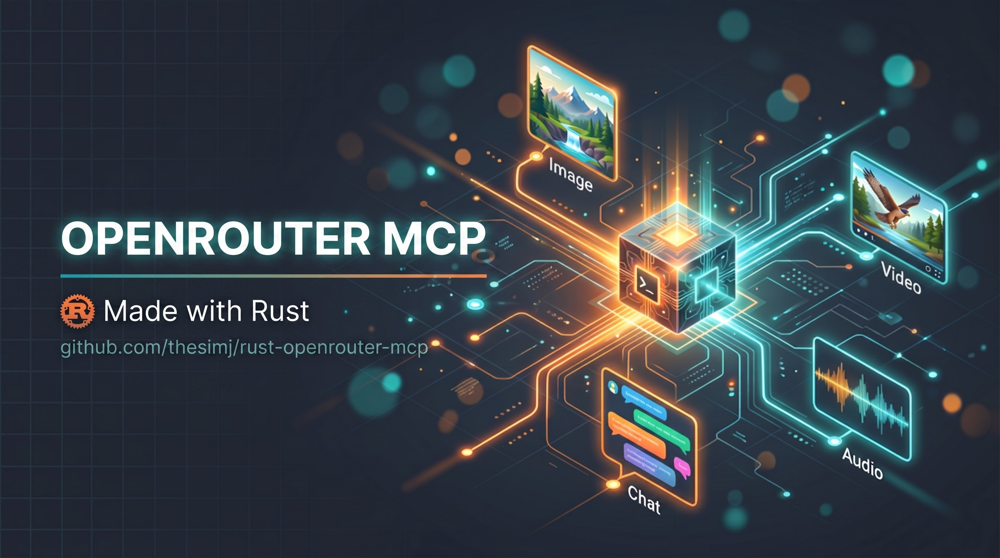

# rust-openrouter-mcp

[](https://github.com/thesimj/rust-openrouter-mcp#license)
[](https://github.com/thesimj/rust-openrouter-mcp/actions/workflows/release-mcpb.yml)
[](https://github.com/thesimj/rust-openrouter-mcp/blob/main/Cargo.toml)

<p align="center">
  
</p>

One small Rust program that gives your AI assistant access to every model on
[OpenRouter](https://openrouter.ai). It runs as an MCP server for Claude
Desktop, Claude Code, Cursor and other clients. Bring your own OpenRouter API key.

## What you can do with it

- **Find models.** Search the catalog by what a model can do, what it costs,
  who serves it, and how well it scores.
- **Make images.** Text-to-image and image editing with any image model.
  Several variants in parallel. Each result gets a sidecar manifest.
- **Make video.** Text-to-video, image-to-video from a first or last frame,
  or reference-to-video from images, audio or clips.
- **Make speech and music.** Text-to-speech, voice cloning from a sample, and
  music from a prompt (Google Lyria).
- **Transcribe audio.** Speech-to-text, with speaker labels when the provider
  supports them.
- **Talk to any chat model.** Send a prompt with images, PDFs, audio or video
  attached. Ask for JSON output. Turn on web search.
- **Embed and rerank text.** Vectors for search, and best-first ranking of
  documents against a query.
- **Ask a decision model.** Send TypeSafe Jev a state and typed questions
  (true/false, pick one, score on a scale). Get calibrated probabilities back
  in about a quarter of a second, with no text generation.
- **Know what you paid.** Every generation result (or its manifest) carries a
  generation id, and one tool looks up the real charge for it.

Every generation tool also accepts a `provider` setting. Use it to choose which provider
serves the request, or to pass a provider's own knobs through. See
[Provider routing](#provider-routing-and-passthrough).

## Install

### Claude Desktop, one click

1. Download the bundle for your platform from the
   [latest release](https://github.com/thesimj/rust-openrouter-mcp/releases/latest):
   `openrouter-mcp-macos.mcpb`, `openrouter-mcp-windows.mcpb`, or
   `openrouter-mcp-linux.mcpb`.
2. Double-click it, or drag it into **Claude Desktop -> Settings -> Extensions**.
3. Click **Install** and paste your [OpenRouter API key](https://openrouter.ai/keys).

Claude Desktop stores the key in the OS credential store and hands it to the
server as `OPENROUTER_API_KEY`. No terminal or Rust toolchain needed.

### Other clients

[CONNECT.md](CONNECT.md) has copy-paste setup for Claude Code, Codex CLI,
Gemini CLI, Cursor, Windsurf, VS Code, Zed, Cline, Roo Code, Continue, Goose,
opencode, Crush, Amp, OpenHands, and more.

One-click buttons for two of them (install the binary first, then replace the
placeholder key):

[](cursor://anysphere.cursor-deeplink/mcp/install?name=openrouter&config=eyJjb21tYW5kIjogIm9wZW5yb3V0ZXItbWNwIiwgImFyZ3MiOiBbIm1jcCJdLCAiZW52IjogeyJPUEVOUk9VVEVSX0FQSV9LRVkiOiAic2stb3ItdjEtWU9VUl9LRVkifX0=)
[](https://insiders.vscode.dev/redirect/mcp/install?name=openrouter&config=%7B%22command%22%3A%20%22openrouter-mcp%22%2C%20%22args%22%3A%20%5B%22mcp%22%5D%2C%20%22env%22%3A%20%7B%22OPENROUTER_API_KEY%22%3A%20%22sk-or-v1-YOUR_KEY%22%7D%7D)

### The binary

```bash
cargo install openrouter-mcp            # from crates.io
cargo install --path . --locked --force # from a checkout
```

Then set your key:

```bash
export OPENROUTER_API_KEY="sk-or-v1-..."      # bash/zsh
$env:OPENROUTER_API_KEY = "sk-or-v1-..."      # PowerShell
```

A `.env` file in the working directory (or one of its parents) works too. Do
not commit it.

Generic MCP client config:

```json
{
  "mcpServers": {
    "openrouter": {
      "command": "openrouter-mcp",
      "args": ["mcp"],
      "env": { "OPENROUTER_API_KEY": "sk-or-v1-..." }
    }
  }
}
```

## The tools

| Tool | What it does |
| --- | --- |
| `list_models` | Search the catalog. Filter by input/output modality, supported parameters, category, provider, author, price, region, zero-data-retention, model age, and benchmark scores. Sort, page, and see pricing in dollars per million tokens. |
| `describe_model` | Everything about one model: architecture, context, benchmarks, and each provider endpoint with its pricing and the `allowed_passthrough_parameters` you may send in `provider.options`. |
| `generate_image` | Text-to-image or image editing. Inputs by path, URL or base64 (up to 16). Pick `aspect_ratio` + `image_size`, or one `size`. Optional `quality`, `output_format`, `background`, `output_compression`, `seed`, `variants`. Long jobs return a `task_id`. |
| `generate_video` | Text-, image- or reference-to-video. Required: `model`, `duration`, `with_audio`. `prompt` is optional when a frame or reference is given. Optional `resolution`, `aspect_ratio`, `size`, `seed`, `creativity`, `upscale_factor`. Almost always returns a `task_id` (after `wait_seconds`, default 20); poll `get_result`. |
| `generate_audio` | Text-to-speech. `voice` is model-specific. Voice cloning: pass a sample as `voice_reference` plus an optional transcript. |
| `generate_music` | Text-to-music with Google Lyria. Returns the track, the lyrics text, and the per-track cost. |
| `transcribe_audio` | Speech-to-text from a file or base64. Optional `language`, `response_format: "verbose_json"` with `timestamp_granularities`, and speaker labels via `provider.options`. |
| `chat_completion` | Send a prompt to any chat model. Attach `images`, `files`, `audio`, `videos`. Ask for `json_mode` or a `json_schema`. Turn on `web_search`. Control sampling and reasoning. |
| `describe_image` | Describe one or more images with a vision model. |
| `embed_text` | Float vectors for a list of texts. |
| `rerank_documents` | Rank documents against a query, best first. |
| `make_decisions` | Ask a decisions model (TypeSafe Jev) named `noul`, `choice` and `score` questions about a `state`. Returns typed answers with probabilities and confidence. See [Decisions](#decisions). |
| `get_generation` | The stored record for a `generation_id`: real cost, provider, tokens, latency. |
| `get_result` | Fetch an async job by `task_id`. |
| `get_account` | Your API key's label, credits, and limits. |
| `get_usage_stats` | This process's request and cost counters. |
| `reset_usage_stats` | Clear those counters. Needs `confirm: true`. |

Every tool description tells the assistant which `list_models` filter finds
the right kind of model, for example `output_modalities="transcription"`.

## Provider routing and passthrough

OpenRouter can route one model to several providers. The `provider` object on
each generation tool lets you steer that.

**Routing** (chat_completion, describe_image, generate_music, embed_text,
rerank_documents, make_decisions): `order`, `only`, `ignore`, `allow_fallbacks`,
`require_parameters`, `zdr`, `sort` (plus `sort_partition`). `generate_image`
takes the subset `order`, `only`, `ignore`, `allow_fallbacks`, `sort` (plus
`sort_partition`), next to its `options`.

```json
{ "provider": { "order": ["anthropic", "google-vertex"], "allow_fallbacks": false } }
```

**Passthrough** (generate_image, generate_audio, transcribe_audio,
generate_video): `options`, keyed by provider slug, holding that provider's own
parameters. Only the provider that serves the request receives them.

```json
{ "provider": { "options": { "deepgram": { "diarize": true } } } }
```

That example turns on speaker labels for a Deepgram transcription. Other common
uses: `{"openai": {"instructions": "speak like a calm narrator"}}` on speech,
`{"black-forest-labs": {"steps": 28, "guidance": 3.5}}` on FLUX images,
`{"google-vertex": {"negativePrompt": "people, text"}}` on Veo video. Run
`describe_model` to see which keys a provider accepts.

Chat-family tools take routing only. OpenRouter's chat schema has no
passthrough field.

## Decisions

A decisions model does not write text. It reads a `state` and answers a set of
questions you define, each with a probability. OpenRouter serves TypeSafe's Jev
(`typesafe/jev-1.13`, alias `~typesafe/jev-latest` - the tilde is required) on
`POST /api/alpha/decisions`, an alpha endpoint outside `/api/v1`.
`chat_completion` cannot use these models. `make_decisions` can. Find them with
`list_models` and `output_modalities="decisions"`.

Three question types:

| `type` | Asks | `criteria` | Answer |
| --- | --- | --- | --- |
| `noul` | Is it true? | optional `{"true": "...", "false": "..."}` | `{"noul": 0.96}` |
| `choice` | Which label? | required `{label: description or null}` | `{"choice": "payments", "confidence": 0.75, "probabilities": {...}}` |
| `score` | How much, on this scale? | required array of 2 to 10 levels, lowest first | `{"score": 1.99, "confidence": 0.99, "legend": {...}, "probabilities": {...}}` |

```json
{
  "model": "typesafe/jev-1.13",
  "state": { "customer_tier": "enterprise", "ticket": "Blank screen after I click Pay." },
  "questions": {
    "is_bug":  { "type": "noul",   "instructions": "Is the customer reporting a software defect?" },
    "team":    { "type": "choice", "instructions": "Which team should own this ticket?",
                 "criteria": { "payments": "Checkout or billing.", "frontend": "Rendering or layout." } },
    "urgency": { "type": "score",  "instructions": "How urgent is this ticket?",
                 "criteria": ["Can wait", "This week", "Blocking revenue now"] }
  }
}
```

The result has one answer per question name, `usage` with token counts and
cost, and a `generation_id`. Jev bills input tokens only ($0.042 per million).
The model never sees your question names.

## Launch and version

Run `openrouter-mcp mcp` to start the MCP stdio server. The bare
`openrouter-mcp` with no arguments starts the same server, so both
`"args": ["mcp"]` and `"args": []` work in client configs.
Use `openrouter-mcp --version` or `openrouter-mcp -V` to print the installed version.
Version checks need no API key. All other arguments exit with status 2 and
print a usage line on stderr.

Existing client configurations from earlier versions keep working unchanged.
The MCP tools replace the former CLI commands (`models`, `image`, `chat`, ...).

For former CLI workflows:

- Have the client read prompt files and send their text as `prompt` or `input`.
- Send a JSON object in `json_schema` instead of a schema filename.
- Combine the output directory and filename into one `output` path.
- Poll `get_result` while an image or video job reports `pending`. Keep the MCP session open.
- For images, specify `size`, or both `aspect_ratio` and `image_size`.
- For video, specify `duration` and `with_audio`. Also specify `aspect_ratio` or `size` unless supplying a first or last frame.
- Use `list_models` for discovery and `describe_model` for detailed pricing, including video SKUs.

Generated files and manifests still save to disk. MCP records prompt provenance as `inline`.

## Configuration

`OPENROUTER_API_KEY` is the only required setting. The rest have sensible
defaults.

| Variable | Purpose | Default |
| --- | --- | --- |
| `OPENROUTER_API_KEY` | Your OpenRouter key. | required |
| `OPENROUTER_MCP_OUTPUT_DIR` | Where generated files land when you give no `output` path. | `$HOME/Downloads/openrouter-mcp`, else the system temp dir |
| `OPENROUTER_MCP_IMAGE_PREVIEWS` | Embed previews of generated media in tool results: `auto`, `always`, `never`. `auto` embeds for every client except Claude Code, which can open the saved file itself. | `auto` |
| `OPENROUTER_IMAGE_MAX_DIMENSION` | Longest side, in pixels, that input images are scaled down to before upload. Hard ceiling 4096. | `1536` |
| `OPENROUTER_VIDEO_POLL_INTERVAL` | Seconds between video status checks. | `5` |
| `OPENROUTER_VIDEO_POLL_TIMEOUT` | Seconds to wait for a video job. | `600` |
| `OPENROUTER_VIDEO_DELIVERY_TIMEOUT` | Seconds allowed for downloading finished clips, retries included. | off |
| `OPENROUTER_MCP_SHUTDOWN_TIMEOUT` | Seconds to let running jobs finish after the client disconnects (max 300). | `30` |
| `OPENROUTER_HTTP_REFERER`, `OPENROUTER_X_TITLE` | App attribution headers shown in OpenRouter rankings. | this repo |

**Limits worth knowing.** Input images: 16 per request, 20 MiB each, 64 MiB per
batch. Audio for transcription, and audio attached to chat: 25 MiB. A
voice-cloning sample: 15 MiB. Files and video attached to chat: 20 MiB each. At
most 32 image or video jobs wait at once, and
8 synchronous calls run at once. Job status lives in memory and is gone when
the server exits.

## Development

```bash
cargo fmt --check
cargo clippy --all-targets --locked -- -D warnings
cargo test --locked
```

CI runs the same three checks plus a `cargo check --all-targets` at the minimum
supported Rust version on every push and pull request. A version tag triggers the release
workflow, which builds the `.mcpb` bundles for macOS, Windows and Linux.

Release notes and the list of OpenRouter features left out on purpose live in
[CHANGELOG.md](CHANGELOG.md).

## Privacy

`openrouter-mcp` runs on your machine and sends nothing anywhere except to
OpenRouter, plus a direct fetch of any image or file URL you pass as input. No
telemetry. Details in [PRIVACY.md](PRIVACY.md).

## License

Apache License 2.0 ([LICENSE-APACHE](LICENSE-APACHE)) or MIT
([LICENSE-MIT](LICENSE-MIT)), at your option.
